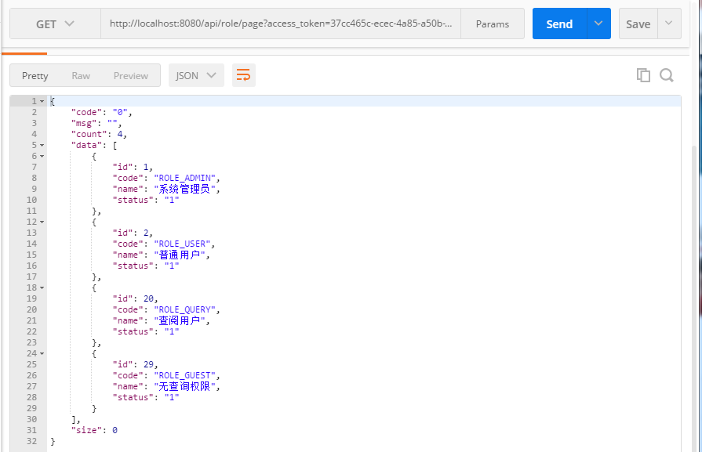

## Oauth2-authorizedGrantType-client
在Spring security的基础上集成Oauth2的客户端认证模式,原权限部分不受影响。

基础权限 功能请访问[springboot-security](https://github.com/ztgreat/springboot-security)

### 未登录访问

### 获取Access_Token

http://localhost:8080/oauth/token?grant_type=client_credentials&client_id=client_1&client_secret=123456

### 通过Access_Token 访问

### 登录

#### 登录后访问

### 注意

不要在同一台电脑上同时测试登录授权和通过Access_Token授权访问，否则授权信息会被覆盖。