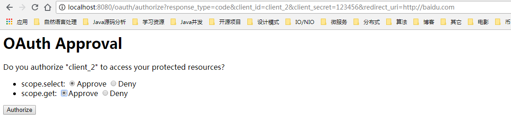
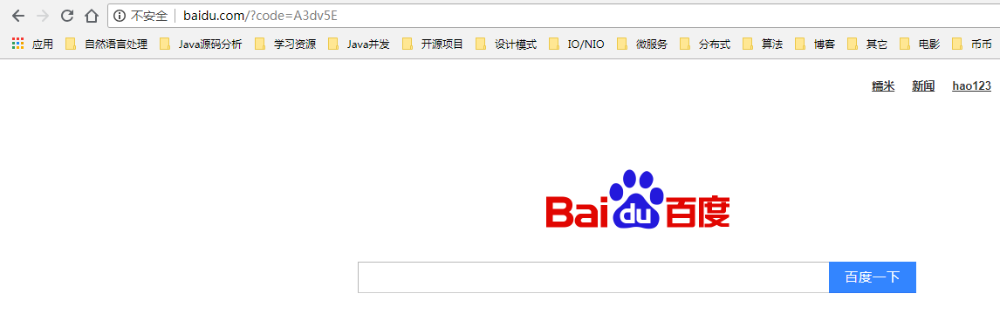
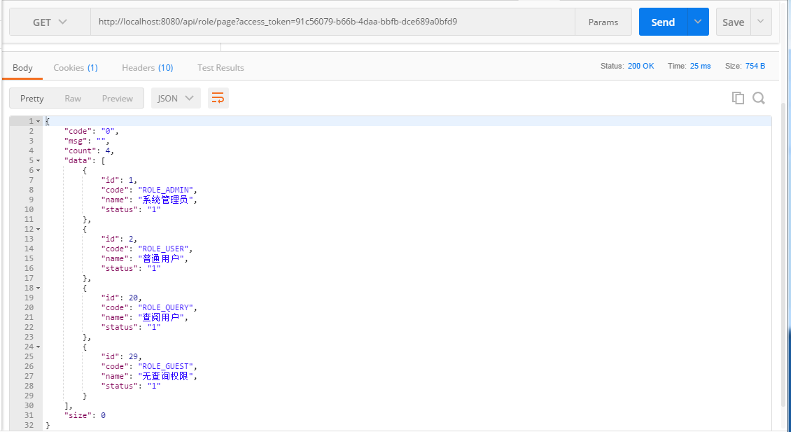

## Oauth2-authorizedGrantType-code
在Spring security的基础上集成Oauth2的授权码认证模式,原权限部分不受影响 

基础权限 项目：[springboot-security](https://github.com/ztgreat/springboot-security)

配合前端展示：[react-authority](https://github.com/ztgreat/react-authority)

### 未登录获取授权码

http://localhost:8080/oauth/authorize?response_type=code&client_id=client_2&client_secret=123456&redirect_uri=http://baidu.com

### 前端登录

账号：admin

密码：000000

注意：这是前后端分离的前端页面

### 授权页面

### 获取授权码

地址栏 code 便是授权码

### 通过授权码获取token

http://localhost:8080/oauth/token?client_id=client_2&client_secret=123456&grant_type=authorization_code&redirect_uri=http://baidu.com&code=A3dv5E

### 通过token 获取数据

>error 页面，以及授权页面都没有重写，只是简单的把功能过了一遍，仅供参考，还有很多没有完善。
>
>项目中都有相应的sql，方便测试

